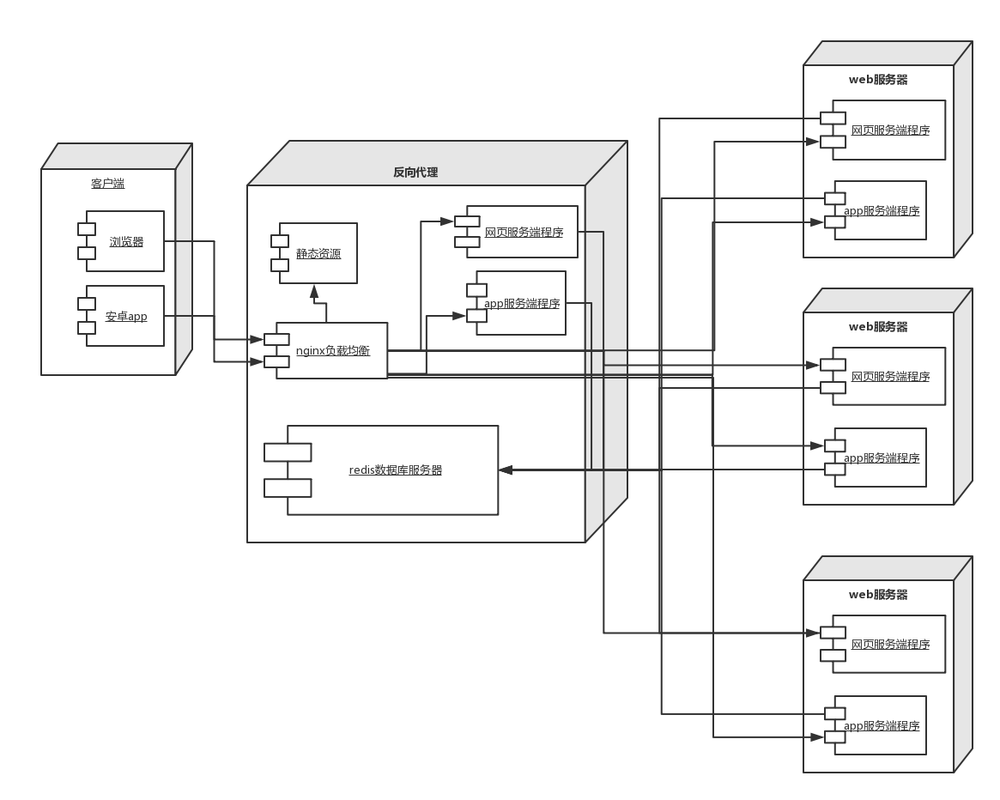

# 毕业论文设计

## 主题

### 业务场景

优惠券发放：某公司委托A网站发放10万份优惠券，合计100万元，启动10元5万份，5元，15元个2.5万份，每个用户每种券最多一张。企业要求在8点，10点，18点，20点四个时段发放，每次不超过10分钟。并收集抢券人ID，券的ID，时间（时分秒）信息，为后期大数据营销提供依据。

假设，网站估计流量会是平时的10倍,约5-10万人。

### 限制

+ 服务器限制4台
+ 使用 Nginx 作为前置服务器。允许缓存静态网页
+ 数据库可使用读写分离
+ 可使用消息中间件预先准备足够的优惠券

### 设计成果要求

+ 用UML组件图给出程序由哪些部分组成
+ 用UML部署图给出部署方案
demo验证程序（测试标准，每分钟最大发券量）

## 开题报告

### 题目

基于优惠券发放业务的高并发系统设计

### 简述

本选题是将分布式系统知识应用于优惠券发放业务。优惠券发放是电商平台常见的一大促销业务，其技术难度主要是让服务器在短时间内能承受大量用户抢优惠券的请求并保证系统的整体稳定，即高并发、高性能和高可用。
实现本项目需要分析高流量优惠券发放业务的具体需求，在有限的资源条件下，利用UML设计系统总体架构，通过分层的思想确定每个系统组件的实现方式，编码实现优惠券发放系统，并进行相应的测试工作，结合测试结果不断进行调试及优化。

### 支持条件

云服务器集群（限制四台）

### 进度安排

+ 2016年12月1日：分析优惠券发放业务，设计系统总体架构
+ 2017年1月10日：逐层实现系统的各个组件，基本实现整体业务功能
+ 2017年3月6日：设计测试方案，不断进行调试优化，并上交中期报告
+ 2017年4月5日：进行报告汇总，上交论文初稿
+ 2017年5月1日：针对指导老师的意见修改论文，上交毕设论文终稿

## 个人思路

### 1. 客户端ui设计

实际上这个项目的重头戏在于后台系统的选型与设计，但是为了理解题意，了解项目的需求，个人认为原型图的设计也是必须的，实际上也很简单：

+ 用户登录，注册等基本环节
+ 查看个人所得优惠券，标记面额和抢券时间
+ 抢优惠券的ui设计
.png)

### 2. 后台系统分析

#### 需求分析

##### 一 发放10万份优惠券，启动10元5万份，5月2.5万份，15元2.5万份，且要求在8点，10点，18点，20点四个时段发放，每次不超过10分钟

关于这个需求，我有以下两个方案：

1. 每一个时段平均发放相等数量的优惠券：也就是说，每个时段发10元优惠券12500份，5元优惠券和15元优惠券各6250份。这样的编码方式最简单，不过如果每个时段的流量相差悬殊，那么可能会造成剩票现象，那么在下一个时段来临之前需要更改下一个时段可发放的优惠券数据，另外也可能限制了每分钟最大发券量的数目（极限值是25000份）
2. 无所谓时段，有多少优惠券发多少：这种方案的编码方式相对困难，因为没有在每个时段对数目进行限制，所以后台可能将长时间处于高负荷的状态，此时需要考虑失效转移等问题，同时编码过程中要尽量注意细节，比如减少web服务程序与redis数据库的交互等等。

##### 二 收集抢券人id，券的id，时间信息

这个需求相对比较简单，每当成功抢到优惠券，使用日志记录即可，不过分布式系统可能需要进行日志的整合操作。

实际上这个信息也能存储在数据库，但是为了分担服务器压力，还是选择使用日志来完成这个功能。

#### 架构

根据上述需求分析，以及题目的限制条件，我设计的架构如下图所示：

1. 客户端分为浏览器和安卓app，均往反向代理服务器发送请求
2. 反向代理服务器的nginx模块会根据url和路由配置等规则将请求转发到对应的服务端程序，同时缓存静态资源
3. 三台web服务器分别部署对应的服务端程序， 包括网页版和app版
4. web服务器的服务端程序将向redis数据库发起频繁的读写请求，抢杀前在Redis中初始化三个counter（c5=25000, c10=50000, c15=25000），分别表示5/10/15元优惠券，当抢杀开始时，服务器程序每次处理一次请求都会给对应的counter进行减一操作，并将成功秒杀的消息发送给消息队列，消息队列处理成功秒杀的消息并存储在mysql中，。

### 3. 实现方式
+ 前端采用vue.js以及webpack技术编写
+ 后端采用spring boot框架搭建