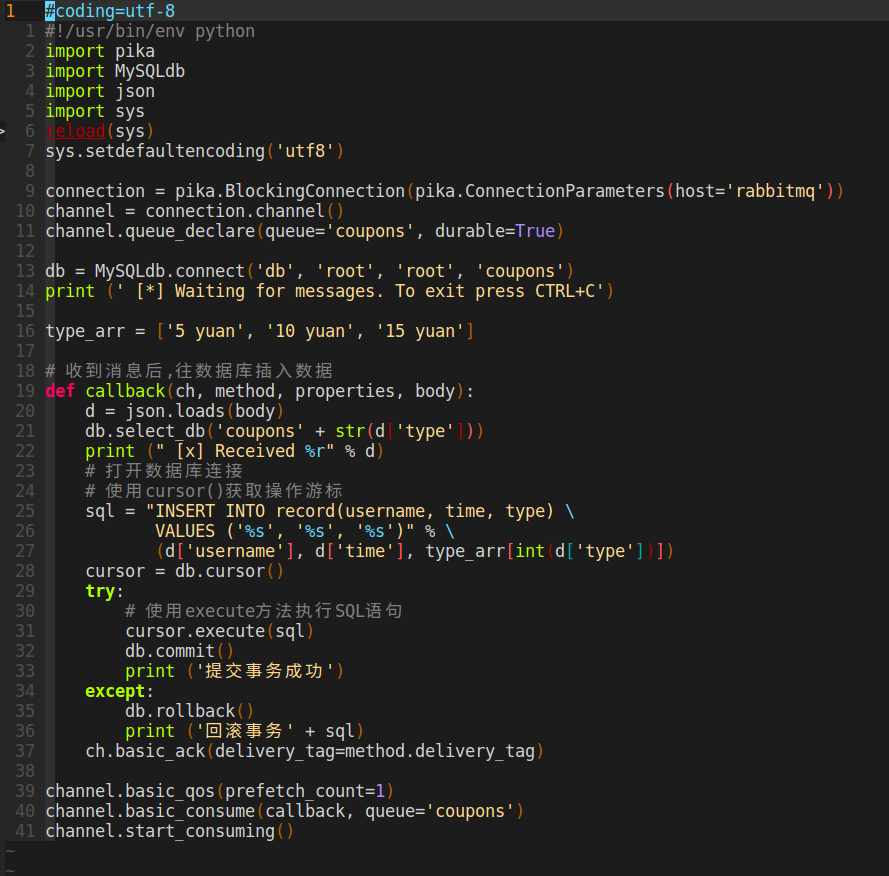

# 高并发秒杀系统模拟

## 1 业务场景
优惠券发放：某公司委托A网站发放10万份优惠券，合计100万元，启动10元5万份，5元，15元个2.5万份，每个用户每种券最多一张。企业要求每次抢券持续时间不宜过长，收集抢券人ID，时间（时分秒）信息，为后期大数据营销提供依据

优惠券发放是电商平台常见的一大促销业务，其技术难度主要是让服务器在短时间内能承受大量用户抢优惠券的请求并保证系统的整体稳定(目标是无超卖和少卖，效率尽量快)

这个项目的重头戏在于后台系统的选型与设计，但是为了理解题意，了解项目的需求，个人认为原型图的设计也是必须的，如下图所示：
+ 用户登录，注册等基本环节
+ 查看个人所得优惠券，标记面额和抢券时间
+ 抢优惠券的ui设计

.png)


## 2 后台系统设计

### 需求分析


如上图所示，假设客户端是app应用，均向反向代理服务器发送请求
1. 反向代理服务器的nginx模块会将请求转发到对应的tomcat服务器
2. 四台tomcat服务器部署对应的服务端程序
3. 秒杀活动启动前，redis服务器将初始化三个变量c0、c1、c2，分别代表5元、10元、15元优惠券的剩余量；mysql服务器也需要导入相应的数据表
4. 当秒杀启动时，用户将选择一种类型的优惠券进行抢杀操作，服务器程序接收到抢杀请求时，将访问redis服务器的c0、c1或c2变量，再进行减一操作，如果减一操作成功，服务器程序将向rabbitmq的消息队列（就是上图那只兔子）发送消息，表示该用户抢杀成功的信息
5. 消费者程序从消息队列里取出消息，然后将消息的内容插入到数据库中


### 具体实现

#### 服务器程序
由于本文焦点在于秒杀操作，这里主要介绍秒杀操作的实现，当app客户端访问/api/secondkill?type=(0|1|2)时服务器的控制层将会执行以下函数，其实就是调用服务层的秒杀函数，如果抛出任何异常都返回false，否则返回服务层的秒杀结果


以下是服务层的秒杀函数，其实主要原理就是所谓的乐观锁：


+ 70行：RedisOpValue其实是我自定义的类，它有两个属性：oldValue和newValue，因为tomcat服务器要进行减一操作，且减一操作返回的值就是在redis服务器进行操作后变量的值（如redis服务器保存变量c=5000，减一操作后变为4999，则tomcat将得到newValue=4999，oldValue=5000）
+ 71-83行：这部分用SessionCallback(详细请看Spring中RedisTemplate的使用方式)定义了一个回调函数，也就是执行减一的操作，但是**只有通过redisTemplate的execute函数才能真正执行它**。至于为什么要用SessionCallback而不直接用template操作，这里涉及到redisTemplate的一个坑，[详情请点击这里](http://blog.csdn.net/congcong68/article/details/52734735)
+ 74行：WATCH命令用于在事务开始之前监视任意数量的键：当调用EXEC命令执行事务时，**如果任意一个被监视的键已经被其他客户端修改了，那么整个事务不再执行，直接返回失败。**。假设客户端要抢10元用户券，对应于redis变量counter1，那么就要先监视counter1，如果不监视，可能出现脏读现象：例如a用户读取的counter1值为9999，b用户读取的counter1值也为9999，如果b先提交了事务，则counter1的值也该变为9998，此时watch命令就会起作用，a用户的减一事务操作直接不再执行，返回失败
+ 75-79行：读取相应redis键的当前值，判断是否大于0，如果不大于0则表示相应的优惠券售罄（redis读操作是原子的）
+ 80-82行：开启一个事务，进行减一操作，并执行事务，返回操作后的RedisOpValue到主程序中
+ 87行：执行回调函数
+ 94-104行：如果回调函数执行成功，则向消息队列发送一条秒杀成功信息（记录了用户名和优惠券类型）

### 消费者程序
消费者程序的逻辑很简单：就是接收消息然后插入到数据库中，代码如下：



对于每一个消息，接收到后就将消息里的数据插入到对应的数据库，注意到要保证事务的一致性（当然要假设消费者服务器不能挂掉啊，否则项目难度又要大一截...）

### 部署
为方便起见，本服务器的部署使用大名鼎鼎的docker-compose。我们将参照下图所示的结构进行部署(同时nginx使用宿主机的nginx也是为了方便- -...)


简单介绍一下docker。对于以上部署图，如果没有docker，我们可能要官网下载很多依赖（redis、rabbitmq、mysql、tomcat等等），然后一一配置相应的环境变量，这是非常麻烦的。所以docker横空出世，可以将其理解为是一种机制，将这些依赖分布到不同的虚拟机上，彼此独立，相互之间的交互则由用户自定义。例如我不需要下载tomcat，只需要运行命令：
```sh
docker pull tomcat:latest
```

就能下载到tomcat镜像，然后再利用docker run 命令则可以启动这个镜像的一个进程。

以下是我的docker-compose文件和根目录概览：


在对应根目录下输入:
```sh
sudo docker-compose up --build
```

熟悉的烂人黄勇进出现了..


### 测试
用python进行秒杀测试是相对方便的（虽然python多线程似乎有点鸡肋）。思路就是对于每一个登录的用户(保存在jwt_list.txt中)都进行一次秒杀的请求，为了保证请求是均匀效果的，使用随机数模拟抢券的权重（因为5元、15元优惠券各25000份，而10元的就有50000份...所以就控制批量请求的权重比是： 5:10:15 =》 1:2:1）


这是运行测试时docker-compose命令窗口显示的输出，可以看到redis高性能的作用，每个请求所花时间的毫秒数相对较低，**如果我们把实现换成一般逻辑，也就是redis的减一操作和mysql的插入记录操作结合起来，那么这么大的用户量是不可能抵得住的**：


Redis和mysql的数据说明**没有超卖或少卖现象**：


下图是消费者程序的输出：


## 3 不足
1. 数据库写速度实在太慢，十八分钟就能完成的事，要拖一小时才能显示在数据库中（越后抢券的用户越会出现这样的延迟问题）
2. 没有做相应的数据可视化操作，希望用JMeter能进行改善